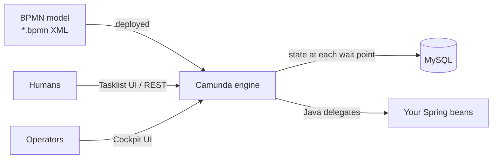
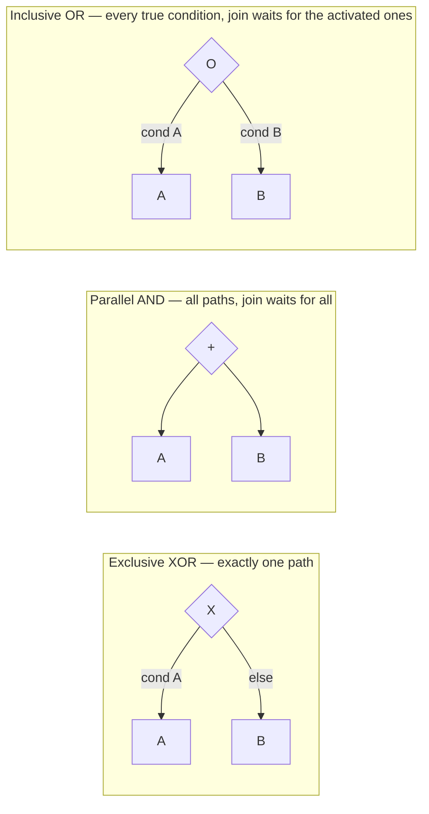
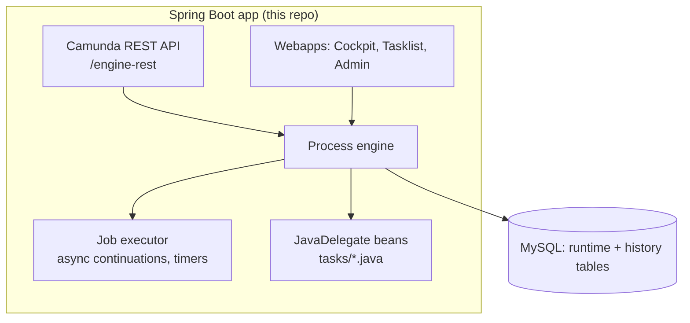
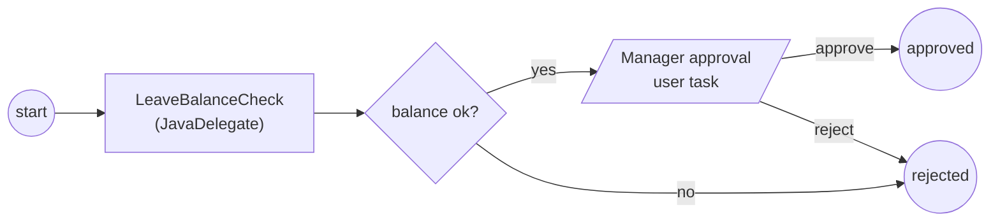
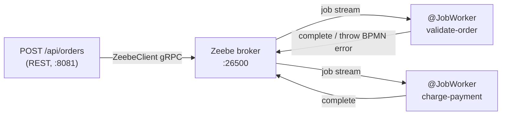

# <span style="color:hsl(3,80%,58%)">Learning Camunda — BPMN Workflow Orchestration</span>


A Spring Boot project for learning the **Camunda 7 BPM platform**: an embedded BPMN 2.0
workflow engine driving ~20 hand-built process models that exercise every major BPMN
construct — tasks, gateways, events, subprocesses, listeners, async continuations and DMN
decision tables.

---

## <span style="color:hsl(141,80%,58%)">Table of contents</span>

1. 🔀 [What is a workflow engine?](#1-what-is-a-workflow-engine)
2. 🔀 [BPMN 2.0 in five minutes](#2-bpmn-20-in-five-minutes)
3. 🔀 [Camunda 7 architecture](#3-camunda-7-architecture)
4. 🔀 [Camunda 7 vs Camunda 8 (Zeebe)](#4-camunda-7-vs-camunda-8-zeebe)
5. 🤖 [Process models in this repo](#5-process-models-in-this-repo)
6. 🧵 [Java delegates, listeners & async continuations](#6-java-delegates-listeners--async-continuations)
7. 🚀 [Running the project](#7-running-the-project)
8. 🔀 [The Camunda webapps](#8-the-camunda-webapps)
9. 🔹 [DMN decision tables](#9-dmn-decision-tables)
10. ⚠️ [Best practices & gotchas](#10-best-practices--gotchas)
11. 🚀 [Camunda 8 module](#10a-camunda-8-module-camunda-8)
12. 🏷️ [End-of-life warning & migration](#11-end-of-life-warning--migration)
13. 📚 [Further reading](#12-further-reading)

---

<a id="1-what-is-a-workflow-engine"></a>
## <span style="color:hsl(278,80%,58%)">1. 🔀 What is a workflow engine?</span>

Long-running business processes — a leave request, a loan approval, an order fulfilment —
span hours to months, mix automated steps with human decisions, and must survive restarts.
Encoding that as `if/else` + scheduled jobs + status columns scatters the process across the
codebase where nobody can see it.

A **workflow engine** makes the process a first-class, executable artifact:

<ul>

- the process is drawn as a **BPMN diagram** — the same picture business and engineering read
- the engine **persists state** at every wait point (user task, timer, message) — a crash resumes exactly where it stopped
- history of every step is recorded — audit for free
- retries, timeouts, escalations, compensation are declarative diagram elements, not bespoke code

</ul>



<a id="2-bpmn-20-in-five-minutes"></a>
## <span style="color:hsl(56,80%,50%)">2. 🔀 BPMN 2.0 in five minutes</span>

BPMN 2.0 is an ISO-standard graphical notation **and** execution semantics — the XML behind
the diagram is what the engine runs. Element families this repo covers:

| Family                    | Elements                                                         | Meaning               |
|---------------------------|------------------------------------------------------------------|-----------------------|
| **Events** (circles)      | start, end, timer, message, signal, conditional, boundary, error | Something *happens*   |
| **Tasks** (rounded boxes) | service, user, manual, script, business-rule, send/receive       | Work gets *done*      |
| **Gateways** (diamonds)   | exclusive (XOR), parallel (AND), inclusive (OR), event-based     | Flow *decides*        |
| **Subprocesses**          | embedded, call activity                                          | Composition & scoping |
| **Flows**                 | sequence flow (+ condition expressions)                          | Ordering              |

Gateway semantics — the part everyone confuses:



The **event-based gateway** is different again: it routes on *whichever event fires first*
(e.g. reply message vs 10-minute timer) — a race, not a condition.

<a id="3-camunda-7-architecture"></a>
## <span style="color:hsl(193,80%,58%)">3. 🔀 Camunda 7 architecture</span>

Camunda 7 is an **embedded engine**: it runs inside this Spring Boot app's JVM and stores
all state in a relational database (MySQL here).



Key pieces:

<ul>

- **Process engine** — interprets BPMN, advances tokens, writes runtime tables (`ACT_RU_*`) and history (`ACT_HI_*`)
- **Job executor** — background thread pool that fires timers and `camunda:asyncBefore/asyncAfter` continuations; each job is a transaction boundary + retry unit (3 retries → *incident*)
- **JavaDelegate** — your Spring bean invoked by a service task (`${beanName}` expression or class binding)
- **Shared ACID transaction** — engine state and your business writes commit together; the property Camunda 8 gives up (see below)
- **Spin plugin** (in this pom) — JSON/XML process-variable serialization

</ul>

<a id="4-camunda-7-vs-camunda-8-zeebe"></a>
## <span style="color:hsl(331,80%,58%)">4. 🔀 Camunda 7 vs Camunda 8 (Zeebe)</span>

([Pretius comparison](https://pretius.com/blog/camunda-7-vs-camunda-8), [Camunda docs: conceptual differences](https://docs.camunda.io/docs/guides/migrating-from-camunda-7/conceptual-differences/), [Altkom 2026 view](https://www.altkomsoftware.com/blog/camunda-7-vs-camunda-8-in-2026/))

|                     | **Camunda 7** (this repo)                   | **Camunda 8**                                                                                                                      |
|---------------------|---------------------------------------------|------------------------------------------------------------------------------------------------------------------------------------|
| Engine              | Embedded in your JVM (or shared app server) | **Zeebe** — distributed, cloud-native, runs on Kubernetes                                                                          |
| State storage       | Relational DB (the scaling bottleneck)      | Event-sourced log on partitioned brokers (RocksDB + replication)                                                                   |
| Business logic      | `JavaDelegate` in-process                   | External **job workers** over gRPC — any language                                                                                  |
| Transactions        | Shared ACID with your code                  | No shared transaction — eventual consistency, idempotent workers required                                                          |
| Expressions         | JUEL (`${...}`), scripting                  | FEEL                                                                                                                               |
| History/ops         | Cockpit on same DB                          | Exported to Elasticsearch → Operate, Optimize                                                                                      |
| Scale               | Vertical + DB tuning                        | Horizontal by adding partitions ([Intuit case](https://camunda.com/blog/2024/08/scaling-workflow-engines-intuit-camunda-8-zeebe/)) |
| Licence status 2026 | **Community edition EOL** — no patches      | Actively developed (8.x)                                                                                                           |

The migration is not an upgrade — process models mostly carry over, but every delegate
becomes a worker and every transactional assumption must be re-examined.

<a id="5-process-models-in-this-repo"></a>
## <span style="color:hsl(108,80%,58%)">5. 🤖 Process models in this repo</span>

`src/main/resources/`:

| BPMN file                      | Demonstrates                                                                         |
|--------------------------------|--------------------------------------------------------------------------------------|
| `process.bpmn`                 | Minimal start → service task → end                                                   |
| `task-learning.bpmn`           | Service/user task basics                                                             |
| `manual-task-learning.bpmn`    | Manual tasks (documented-only steps)                                                 |
| `exclusive-gateway.bpmn`       | XOR routing on condition expressions                                                 |
| `parallel-gateway.bpmn`        | AND fork/join                                                                        |
| `inclusive-gateway.bpmn`       | OR fork/join                                                                         |
| `event-based-gateway.bpmn`     | First-event-wins routing                                                             |
| `message-start-event.bpmn`     | Start a process by correlated message                                                |
| `signal-start-event.bpmn`      | Broadcast signal starts                                                              |
| `conditional-start.event.bpmn` | Condition-triggered start                                                            |
| `subprocess-test.bpmn`         | Embedded subprocess scoping                                                          |
| `asynchornous-test.bpmn`       | `asyncBefore` job-executor continuations                                             |
| `leave-management.bpmn`        | End-to-end example: request → balance check (delegate) → manager user task → outcome |

`src/test/resources/7.12-bpmn-dmn-files/` adds boundary events, error throw/catch,
BPMN-in-BPMN (call activities), connectors, task listeners, incidents from failed
expressions, and a DMN table (`Numbernature.dmn`).

Leave-management flow:



<a id="6-java-delegates-listeners--async-continuations"></a>
## <span style="color:hsl(246,80%,58%)">6. 🧵 Java delegates, listeners & async continuations</span>

| Class                                                                | Role                                                  |
|----------------------------------------------------------------------|-------------------------------------------------------|
| `tasks/*.java` (`LeaveBalanceCheck`, `WelcomeTasks`, `Asyn*Task`, …) | `JavaDelegate`s bound to service tasks                |
| `listeners/SampleExecutionListener`                                  | Fires on flow-element start/end — cross-cutting hooks |
| `listeners/SampleTaskListener`                                       | Fires on user-task lifecycle (create/assign/complete) |

Async continuation is the pattern to internalize: marking a task `asyncBefore="true"` makes
the engine **commit and hand the token to the job executor**. That decouples the HTTP thread
from long work, creates a retry boundary, and is where incidents appear when retries are
exhausted.

<a id="7-running-the-project"></a>
## <span style="color:hsl(23,80%,58%)">7. 🚀 Running the project</span>

Prereqs: Java, Maven, MySQL on `localhost:3306` (`root`/`password` — the schema
`camunda` auto-creates).

```bash
mvn spring-boot:run
```

| Thing                            | URL                                           |
|----------------------------------|-----------------------------------------------|
| Webapps (Cockpit/Tasklist/Admin) | http://localhost:8080 — login `admin`/`admin` |
| REST API                         | http://localhost:8080/engine-rest             |

Start a process instance via REST:

```bash
curl -s -X POST http://localhost:8080/engine-rest/process-definition/key/leave-management/start \
  -H 'Content-Type: application/json' \
  -d '{"variables":{"empName":{"value":"himansu"},"days":{"value":3,"type":"Integer"}}}'
```

Tests: `mvn test` (uses H2 + `camunda.cfg.xml`, no MySQL needed).

<a id="8-the-camunda-webapps"></a>
## <span style="color:hsl(161,80%,58%)">8. 🔀 The Camunda webapps</span>

<ul>

- **Cockpit** — operations: live instances, where tokens sit, incidents, retries, variable inspection
- **Tasklist** — human work: claim/complete user tasks with generated or embedded forms
- **Admin** — users, groups, authorizations

</ul>

Cockpit on the history tables is the killer feature of C7 for debugging: click any finished
instance and see the exact path the token took.

<a id="9-dmn-decision-tables"></a>
## <span style="color:hsl(298,80%,58%)">9. 🔹 DMN decision tables</span>

`Numbernature.dmn` shows the companion standard to BPMN: **DMN** decision tables evaluate
business rules (hit policies, FEEL-ish expressions) and are invoked from BPMN via a
business-rule task. Rules change without redeploying diagrams — the classic
"decision logic belongs to the business" separation.

<a id="10-best-practices--gotchas"></a>
## <span style="color:hsl(76,80%,58%)">10. ⚠️ Best practices & gotchas</span>

| Practice                                                  | Why                                                                                    |
|-----------------------------------------------------------|----------------------------------------------------------------------------------------|
| `historyTimeToLive` set (this repo: `P1D`)                | Mandatory since 7.20 for cleanup; unbounded history eats the DB                        |
| Async boundaries before external calls                    | Retry + incident isolation instead of failing the user's HTTP request                  |
| Expression-bound delegates (`${bean}`) over class binding | Spring-managed, mockable, no engine classloading surprises                             |
| Correlate messages with business keys                     | `runtimeService.correlateMessage` needs uniqueness — business key beats variable scans |
| Keep delegates idempotent                                 | Job retries re-execute them                                                            |
| Version process definitions, never edit deployed XML      | Running instances stay on their version; new starts get the new one                    |
| Don't put big payloads in process variables               | They serialize into the DB per step; store a reference instead                         |

## <span style="color:hsl(213,80%,58%)">11. 🚀 Camunda 8 module (`camunda-8/`)</span>

A self-contained sibling project — separate `pom.xml`, own `mvn` lifecycle — so the C7 app
above keeps building unmodified. Same order-approval idea, rebuilt on the Camunda 8
architecture: no shared transaction, no embedded engine, business logic runs as external
**job workers** talking to the Zeebe broker over gRPC.



`order-process.bpmn` is hand-written with Zeebe extensions
(`zeebe:taskDefinition type="validate-order"`, etc.) and auto-deployed on startup. Run it:

```bash
cd camunda-8
docker compose up -d          # Zeebe broker only, ports prefixed camunda8-
mvn spring-boot:run           # port 8081 — the C7 app owns 8080
curl -s -X POST localhost:8081/api/orders -H 'Content-Type: application/json' \
  -d '{"orderId":"1","amount":99.50}'
```

Tests use `zeebe-process-test-extension` — an embedded, in-JVM broker — so `mvn test` needs
no Docker and stays fast.

<a id="11-end-of-life-warning--migration"></a>
## <span style="color:hsl(351,80%,58%)">12. 🏷️ End-of-life warning & migration</span>

This repo pins **Camunda 7.21**. As of 2026 the **Camunda 7 Community Edition is
end-of-life** — no security patches or updates ([Altkom, 2026](https://www.altkomsoftware.com/blog/camunda-7-vs-camunda-8-in-2026/)).
Options: commercial C7 extended support (until 2030), migrate to Camunda 8
(re-platform: delegates → gRPC job workers, JUEL → FEEL, no shared transactions), or an
alternative embedded engine (Flowable, jBPM descendants). For a learning repo C7 remains
the fastest way to grasp BPMN semantics — the notation itself transfers 1:1 to Camunda 8.

<a id="12-further-reading"></a>
## <span style="color:hsl(128,80%,58%)">13. 📚 Further reading</span>

<ul>

- [Camunda 7 docs](https://docs.camunda.org/manual/7.21/) · [BPMN 2.0 reference](https://camunda.com/bpmn/reference/)
- [Camunda 8 docs — migrating from 7](https://docs.camunda.io/docs/guides/migrating-from-camunda-7/conceptual-differences/)
- [Camunda 7 vs 8 — Pretius](https://pretius.com/blog/camunda-7-vs-camunda-8) · [Altkom 2026](https://www.altkomsoftware.com/blog/camunda-7-vs-camunda-8-in-2026/) · [RST Software](https://www.rst.software/blog/camunda-7-vs-camunda-8---key-differences-and-considerations-before-migration)
- [Scaling Zeebe at Intuit](https://camunda.com/blog/2024/08/scaling-workflow-engines-intuit-camunda-8-zeebe/)

</ul>
